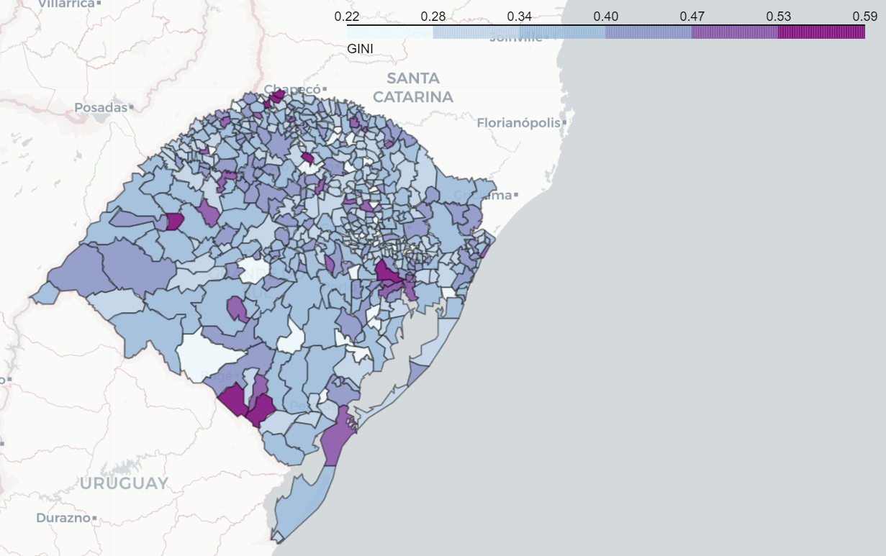

# Coeficiente de Gini - RAIS

Este repositório possui um passo a passo de como utilizar os microdados da Relação Anual de Informações Sociais utilizando o Python para gerar medidas de distribuição de renda como o Coeficiente de Gini para cada município

Todo o passo a passo se encontra no arquivo jupyter do projeto
